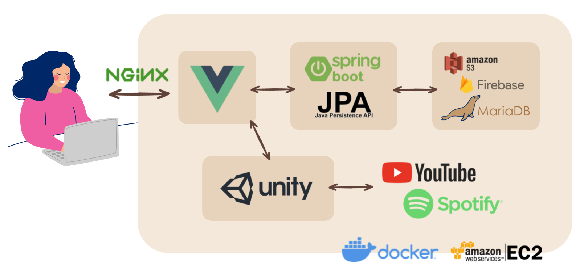

# 📀 CoMu(코뮤)

> 음악 공유 서비스, CoMu

 

## ⭐️ 프로젝트 소개

#### 가상 공간에서 사람들과 음악을 공유하며 세대를 어울러 소통하는 서비스

- **진행 기간:** 2021.10.12 ~ 진행 중 🔥

- **서비스 주요 기능** 
  - 가상 공간에서 사람들과 만남
  - 사람들과 음악과 이야기를 공유
  - 다양한 세대의 사람들과 소통
  - 나만의 플레이리스트 저장

 

## 🧩 서비스 아키텍처

 

## 😎 팀원 소개

|원지연|김우현|류한길|박지현|신지수|
|:--:|:--:|:--:|:--:|:--:|
|`Front-end` `Project Manager` `UI/UX Design`|`Front-end` `UI/UX Design`|`Unity` `CI/CD`|`Back-end` `Redis`|`Back-end` `UI/UX Design`|

 

## 🗂 개발 문서

### ✔️ [Git Covention](docs/Git-Convention.md)

### ✔️ [Code Covention](docs/Code-Convention.md)

### 🐾 [프로젝트 타임라인](https://co-mu.notion.site/2249572853c84973b422cdcfedebcac5?v=5b272ec6b98146549bec4ed00ef1a3ce)

### 📅 [프로젝트 캘린더](https://co-mu.notion.site/8bbdf66a6ba8411ebdd5a12cb56e48b4?v=f6d77a4acadc4756a020c20558f90542)

 
