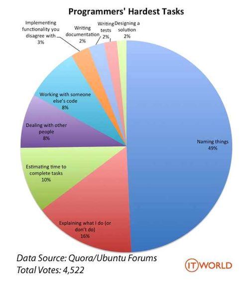

# ✔️ Code Convention

#### 🐱 [Back-end](assets/Back-end.md)

#### 🐶 [Front-end](assets/Front-end.md)

- 주석 필수❗️
    - 내 코드를 남이 읽었을 때 비교적 쉽게 이해할 수 있도록 (적당히...★⭐️★⭐️★)
- 변수명 공식문서에 맞게 짓기
    - 한글 그대로 영어로 쓰지 말기 (ex. saram ❌ → user ⭕️)

### 참고

📄 [java 코딩 규칙](https://myeonguni.tistory.com/1596)

📄 [Vue 코딩 규칙](https://kr.vuejs.org/v2/style-guide/index.html)

