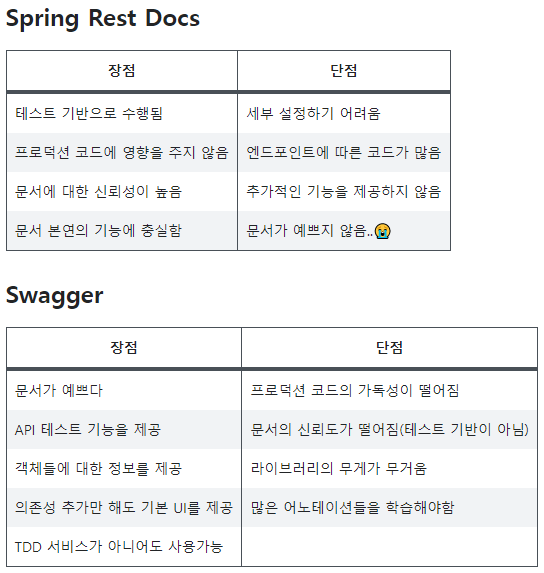

# 🐱 Back-end

📄 [자바 코딩 규칙(Java Code Conventions)](https://myeonguni.tistory.com/1596)

## 주석

- //
- /* */


## 메서드 괄호

- ) {

```java
if (condition) {
			
}
```


## 컨트롤러 ResponseEntity

```java
@PostMapping("/list")
public ResponseEntity<PSI> getPerfumes(@RequestBody PLS perfumeSearch) {
	List<PSI> response = perfumeService.getPerfumeList(perfumeSearch);
  if (response == null) {
	    return ResponseEntity.status(HttpStatus.NOT_FOUND);
	}
	    return ResponseEntity.status(HttpStatus.OK).body(response);
	}
```


## 클래스명

- pascal 표기식


## 함수명

- camel 표기식


## 변수명

- camel 표기식


## Tech Stack

### ✅ Spring Boot

😎 사용 이유

- 개발하기 편한 익숙한 프레임워크이고, 아직 충분히 사용해보지 않은 것 같아서 더 사용해보고 싶다
- java 에 맞는 프레임워크이다.
- 다양한 개발사례와 문서, 레퍼런스를 찾기 쉽다.
- Spring을 편하게 이용할 수 있도록 한다. starter를 통해 라이브러리 의존성을 간단히 처리해주고, 프로젝트에 추가된 라이브러리를 기반으로 실행에 필요한 환경을 자동으로 설정해준다.
- JUnit을 비롯한 테스트 관련 라이브러리들이 기본적으로 포함되어 있기 때문에 컨트롤러를 비롯한 다양한 계층의 클래스들에 대해서 테스트 케이스를 쉽게 작성할 수 있다.
- Tomcat 서버를 내장하고 있기 때문에 단지 main() 메소드를 가진 클래스를 실행하는 방식으로 서버를 구동하기 때문에 실행결과를 빠르게 확인할 수 있다.


### ✅ MariaDB

😎 사용 이유

- MySQL보다 가볍고 빠르다. (서버 부하를 줄임?)
- 라이센스가 더 자유롭다.
- MySQL과 호환이 되어 설정과 개발에 별다른 공수없이 쉽게 갈아탈 수 있다.

✏ 사용 계획

- EC2 서버에 설치 → 이후 비용 지원되면 RDS 사용
- 서버에 직접 설치(도커 사용 x)
- [https://this-programmer.tistory.com/entry/과연-도커Docker-컨테이너를-통해-데이터베이스를-운영하는-게-좋은-방법일까](https://this-programmer.tistory.com/entry/%EA%B3%BC%EC%97%B0-%EB%8F%84%EC%BB%A4Docker-%EC%BB%A8%ED%85%8C%EC%9D%B4%EB%84%88%EB%A5%BC-%ED%86%B5%ED%95%B4-%EB%8D%B0%EC%9D%B4%ED%84%B0%EB%B2%A0%EC%9D%B4%EC%8A%A4%EB%A5%BC-%EC%9A%B4%EC%98%81%ED%95%98%EB%8A%94-%EA%B2%8C-%EC%A2%8B%EC%9D%80-%EB%B0%A9%EB%B2%95%EC%9D%BC%EA%B9%8C)


### ✅ Swagger

😎 사용 이유

- REST API를 설계, 빌드, 문서화 및 사용하는 데 도움이되는 OpenAPI 사양을 중심으로 구축 된 오픈 소스 도구 세트
- 적용하기 쉽다.
- 테스트할 수 있는 UI를 제공한다.
- 객체들에 대한 정보를 제공한다.
- [https://velog.io/@banjjoknim/Swagger](https://velog.io/@banjjoknim/Swagger)




### ✅ JPA

- 지루하고 반복적인 일을 JPA가 대신 처리해주어 생산성이 향상된다.
- SQL에 종속적이지 않은 객체 지향적 코드 작성을 가능하게 한다. → 유연성 증가
- 개발자가 SQL을 직접 작성하는 수고를 줄여준다.  → 개발에 몰입


### ✅ Gradle

📄 [[Spring] 빌드 관리 도구 Maven과 Gradle 비교하기](https://jisooo.tistory.com/entry/Spring-%EB%B9%8C%EB%93%9C-%EA%B4%80%EB%A6%AC-%EB%8F%84%EA%B5%AC-Maven%EA%B3%BC-Gradle-%EB%B9%84%EA%B5%90%ED%95%98%EA%B8%B0)


### 배포 자동화

- Docker
- CI/CD 젠킨스
- Nginx 와 certbot


### GraphQL