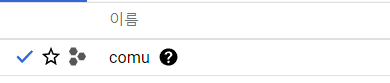
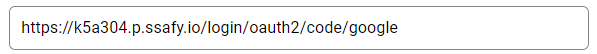
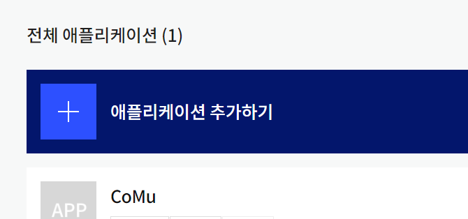
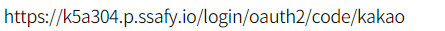
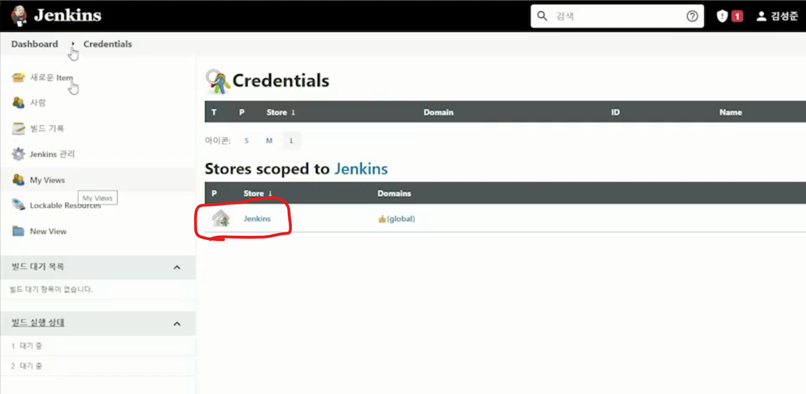
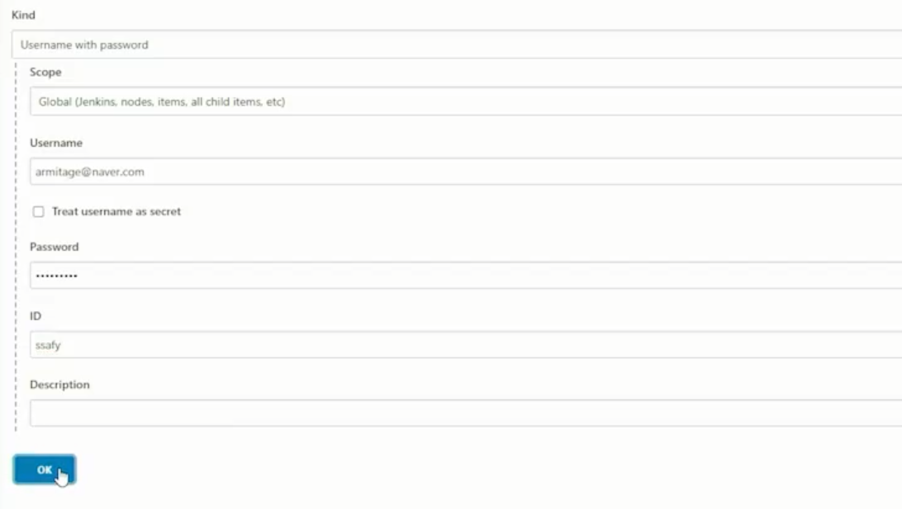
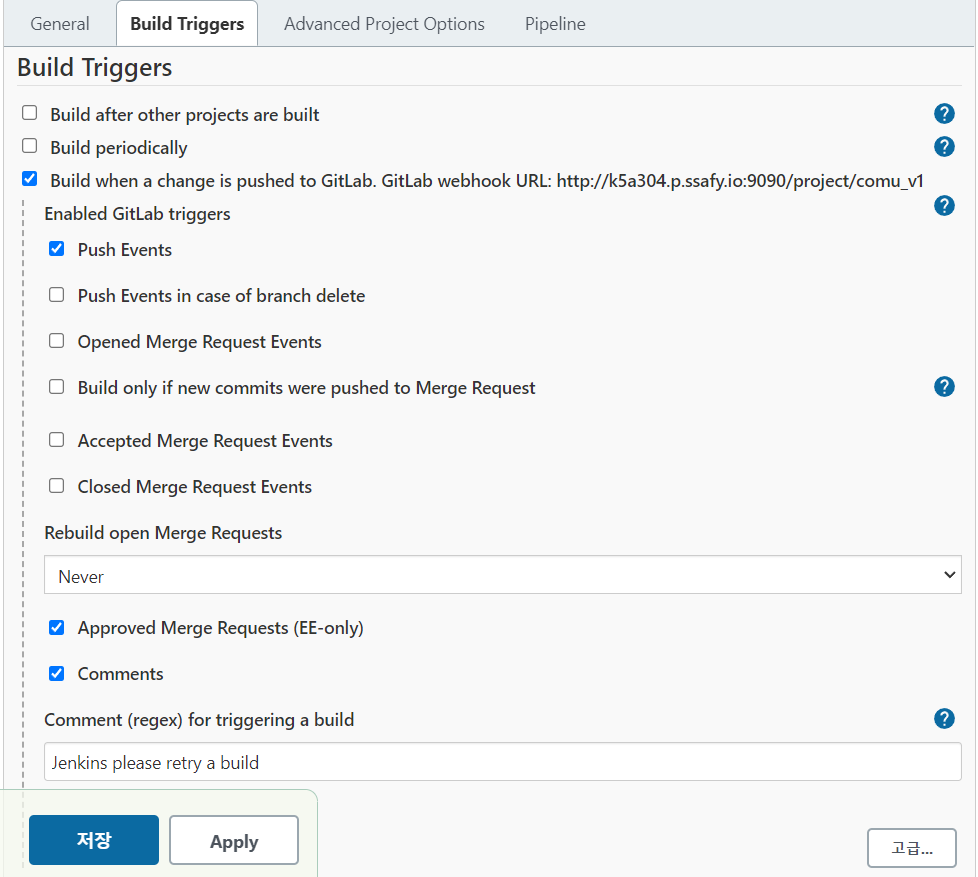
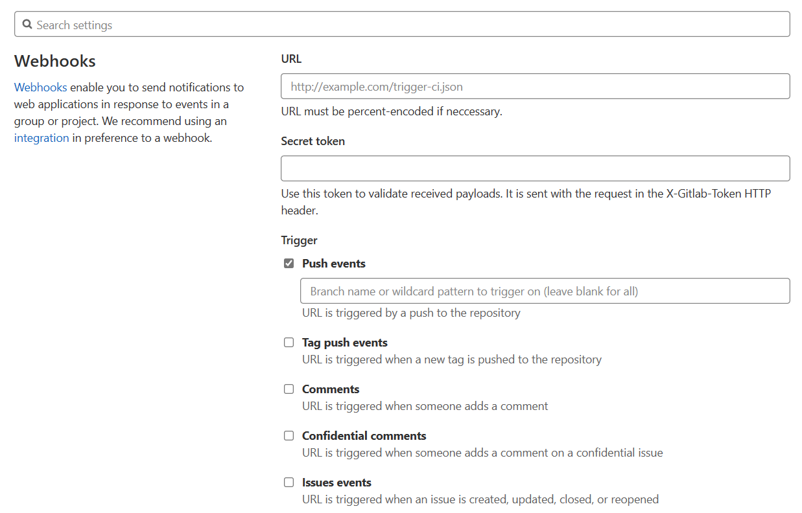
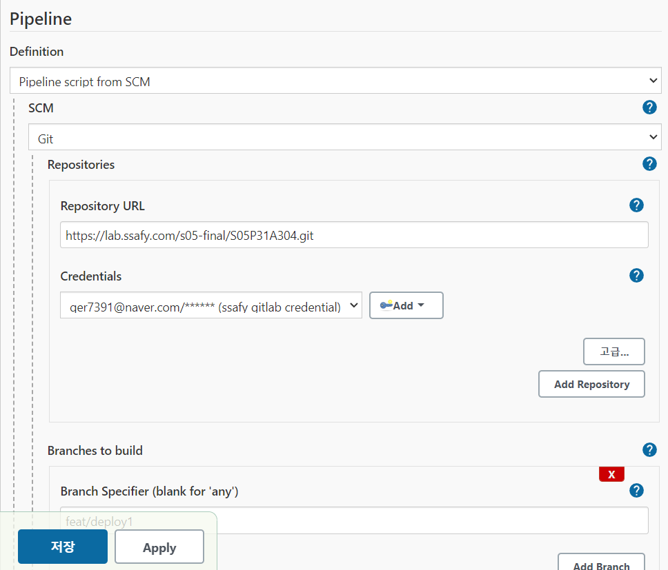

# 💻 개발 환경
- Unity 2019.4.32f1
- WebGL
- Redis:alpine
- nginx-rtmp-module
- ffmpeg version 4.2.4-1ubuntu0.1 (built with gcc 9)
- youtube-dl 2021.06.06
- Open JDK 1.8
- Spring Boot 2.5.6
- Gradle `gradle-7.2`
- IntelliJ IDEA 2021.2.3 (Ultimate Edition)
- Vuejs 2.6.11
- Vuex 3.6.2
- Vuex-persistance 4.1.0
- Amazon Firebase ReatileDB
- hls.js 1.1.1
- core-js 3.6.5

# 🔎 외부 서비스 정보

## ✅ 포톤

https://doc.photonengine.com/ko-kr/pun/current/getting-started/pun-intro

사이트 회원가입/로그인 후 AppID를 발급받아

유니티 프로젝트에서 AssetStore를 통해 Photon Voice2 에셋을 추가한 후 발급받은 AppID로 Setup Wizard를 진행 후 사용 가능


## ✅ 소셜 로그인

### 구글 로그인

- https://console.cloud.google.com/apis?pli=1 사이트에 접속하여
- 프로젝트 생성



- Oauth 2.0 클라이언트 ID와 보안 비밀을 받는다.
- 승인된 리디렉션 URI에 우리 사이트를 등록해준다.



- application-secrity.yml 파일을 생성하여

```
spring:
  security:
    oauth2.client:
      registration:
        google:
          clientId: {여기에 발급받은 값 각각 값 넣어줌}
					clientSecret: {여기에 발급받은 값 각각 값 넣어줌}
					scope:
            - email
            - profile
```

### 카카오 로그인

- https://developers.kakao.com/ 사이트에 접속하여
- 어플리케이션을 생성한다



- Rest API 키( 추후 Client-ID )를 저장하고, 이것을 가지고 Client-Secret도 함께 생성한다.
- 리디렉션 URI를 다음과 같이 등록해준다.



- 아래처럼 yml파일에 등록한다.

```
spring:
  security:
    oauth2.client:
      registration:
        kakao:
          clientId: {여기에 발급받은 값 각각 값 넣어줌}
					clientSecret: {여기에 발급받은 값 각각 값 넣어줌}
					clientAuthenticationMethod: post
          authorizationGrantType: authorization_code
					redirectUri: <https://k5a304.p.ssafy.io/login/oauth2/code/kakao>
					clientName: Kakao
```

- 카카오에서 어떠한 항목도 필수로 받지 않았기 때문에 별도의 검수를 거치지 않고도 사용할 수 있었다.
- build.gradle에 추가

```
implementation 'org.springframework.boot:spring-boot-starter-oauth2-client'
implementation 'org.springframework.boot:spring-boot-starter-security'
```
## ✅ 기타 외부 API
### spotify API
https://developer.spotify.com/

해당 사이트에 접속하여 Spotify 가입 > 로그인 > Dashboard > Spotify App 생성한 뒤, Client ID와 secret KEY를 받는다.

Spotify API를 요청이 필요할 때마다, 발급받은 Client ID와 secret KEY로 `https://accounts.spotify.com/api/token, Client id, client secret` 로 POST 요청을 보내 응답으로 받아온 Access Token을 사용한다.

참고 : https://pearlluck.tistory.com/488

### youtube API
https://developers.google.com/youtube/v3/getting-started?hl=ko
를 참고하여 API키를 발급받아 사용한다.

google API 콘솔> 애플리케이션 등록 > Youtube Data API 서비스 선택 > API 목록에서 YouTube Data API 상태 ON

해당 콘솔에서 받은 Access key를 API 요청시 사용하도록 한다.

참고 : https://senticoding.tistory.com/37


# 🛠 Porting Manual

## 💻 로컬 호스트

### MobaXterm 설치

[공식 홈페이지 다운로드 페이지](https://mobaxterm.mobatek.net/download.html)에서 Home Edition(Free) → Portable edition(무설치) 다운로드 압축 풀고 실행해 사용

처음 실행시 왼쪽 상단 Session 클릭해 서버 정보 등록

Advanced SSH settings 에서 Use private key 선택하고 제공받은 서버 키 등록 → OK하면 원격 접속 세션 시작.

## 🖥 첫 번째 우분투(서버)에서
### 음악 스트리밍에 필요한 라이브러리 설치
_로컬 호스트에서 테스팅하고자 한다면 설치 필수_

```bash
sudo apt-get update
sudo apt install ffmpeg
sudo apt install youtube-dl
```

### Docker 설치

참고 url: [Docker Install Guide](https://docs.docker.com/engine/install/ubuntu/)

Install using the repository

```bash
sudo apt-get update

sudo apt-get install \\
    ca-certificates \\
    curl \\
    gnupg \\
    lsb-release

curl -fsSL <https://download.docker.com/linux/ubuntu/gpg> | sudo gpg --dearmor -o /usr/share/keyrings/docker-archive-keyring.gpg

echo \\
  "deb [arch=$(dpkg --print-architecture) signed-by=/usr/share/keyrings/docker-archive-keyring.gpg] <https://download.docker.com/linux/ubuntu> \\
  $(lsb_release -cs) stable" | sudo tee /etc/apt/sources.list.d/docker.list > /dev/null
```

Install Docker Engine (latest version)

```bash
sudo apt-get update
sudo apt-get install docker-ce docker-ce-cli containerd.io
```

설치 확인

```bash
sudo docker run hello-world
```

### docker-compose 설치

```docker
sudo apt-get install docker-compose
sudo docker-compose version
```


## 젠킨스 설치

- Dockerfile

```
FROM jenkins/jenkins
USER $USER
RUN curl -s https://get.docker.com/ | sh
RUN curl -L "https://github.com/docker/compose/releases/download/1.28.5/docker-compose-$(uname -s)-$(uname -m)" -o /usr/local/bin/docker-compose && \
    chmod +x /usr/local/bin/docker-compose && \
    ln -s /usr/local/bin/docker-compose /usr/bin/docker-compose
RUN curl -sL bit.ly/ralf_dcs -o ./dcs && \
    chmod 755 dcs && \
    mv dcs /usr/local/bin/dcs
RUN usermod -aG docker jenkins
```

- docker-compose.yml

```
version: '3'
services:
  jenkins:
    privileged: true
    build: .
    restart: always
    ports:
      - "9090:8080"
      - "50000:50000"
    expose:
      - "9090"
      - "50000"
    volumes:
      - './jenkins_space:/var/jenkins_home'
      - '/var/run/docker.sock:/var/run/docker.sock'
    environment:
      TZ: "Asia/Seoul"

```

/home/ubuntu 에 두 파일 위치시키고 docker-compose up -d


### 젠킨스 트리거 설정

Jenkins 관리 → (System Configuration) 플러그인 관리 → gitlab 검색해서 설치

Jenkins 관리 → (Security) Manage Credentials

젠킨스에서 타 시스템에 접속할 때 아이디/패스워드 계정 정보를 관리하는 곳



jenkins 클릭 → global credentials → 좌측 Add Credentials



username 에 깃랩 계정 아이디

password 에 깃랩 계정 비밀번호

ID 에는 젠킨스에서 해당 credential에 접근하기 위해 쓸 아이디 적당히

프로젝트의 구성 혹은 프로젝트 만들 때 설정



웹훅 URL 복사해두기(gitlab 설정할 때 사용)

우측 하단 고급 누르고 Secret token 항목에서 Generate 눌러 생성되는 token도 복사해두기

gitlab → 프로젝트 클릭 → Setting → Webhook



URL에 Jenkins에서 복사한 웹훅 URL 입력.

secret token에 아까 복사한 secret token 입력.

Push events는 develop에 한정하기

Add Webhook 하고 test 눌러서 push events 해서 Jenkins에서 빌드 시작하면 연결 잘 된 것. (test는 프로젝트 설정 완료한 후에)



pipeline은 위와 같이 설정. Pipeline script from SCM 하면 Git 최상단 루트에 있는 Script Path로 등록된 파일(기본: Jenkinsfile)에 있는 스크립트 씀.

깃 URL 쓰고 Credentials에는 등록해둔 Gitlab Credential 사용.

Branches to build 는 말 그대로 빌드/배포 대상이 될 브랜치. develop

다른 브랜치로 실험해볼 때는 그 브랜치 이름으로 하면 됨.


## DB

```
# 이미지 다운로드
docker pull mariadb
# 컨테이너 구동
docker run --name mariadb -d -p 3306:3306 -e MYSQL_ROOT_PASSWORD=mariadb mariadb -e LC_ALL=C.UTF-8 mysql:8
```

서버에 db 폴더에 dump 파일 업로드 후 mariadb 컨테이너에 옮기기

```
docker cp [host 파일경로] [container name]:[container 내부 경로]
docker cp ./comu1.sql mariadb:home
```

mariadb 접속해 dump

```
docker exec -it mariadb /bin/bash
mysql -u root -p comu < ./home/comu1.sql
```

docker network 설정

```
docker network create mysql
docker network connect mysql mariadb
```


## 백엔드

- redis 이미지 받아오기 및 컨테이너 생성 및 구동

```
docker pull redis:alpine
docker run -p 6379:6379 --name redis_boot -d redis:alpine
```

- docker network 구축

```
docker network create redis-back
docker network connect redis-back redis_boot
```

- Dockerfile

```
# build stage
FROM openjdk:8-jdk-alpine as builder
# RUN addgroup -S spring && adduser -S spring -G spring
# USER spring:spring

COPY . .
# RUN chmod +x ./gradlew
RUN ./gradlew clean build -x test
RUN mkdir -p build/dependency
WORKDIR build/dependency
RUN jar -xf ../libs/Comu-0.0.1-SNAPSHOT.jar
WORKDIR ../..

# product stage
FROM openjdk:8-jdk-alpine
ARG DEPENDENCY=build/dependency
COPY --from=builder ${DEPENDENCY}/BOOT-INF/lib /app/lib
COPY --from=builder ${DEPENDENCY}/META-INF /app/META-INF
COPY --from=builder ${DEPENDENCY}/BOOT-INF/classes /app
ENTRYPOINT ["java","-cp","app:app/lib/*","com.listener.comu.BackendApplication"]
```


### 로컬 파일 resources 반영

MobaXterm/Putty 등으로 서버에 접속한 후

`home/ubuntu/jenkins_space/workspace/comu_v1/backend/src/main/resources` 에 있는 파일을

`sudo vi application*.yml` 명령어로 열어서 수정하시면 됩니다.


## 프론트엔드 (Vue + nginx)

- Dockerfile

```
# build stage
FROM node:14-alpine as build-stage
WORKDIR /app
COPY package*.json ./
RUN npm install
COPY . .
RUN npm run build

# production stage
FROM nginx:stable-alpine as production-stage
COPY ./nginx.conf /etc/nginx/nginx.conf
COPY ./comu.conf /etc/nginx/conf.d/comu.conf
COPY --from=build-stage /app/dist /usr/share/nginx/html
EXPOSE 80
CMD ["nginx", "-g", "daemon off;"]
```

- nginx.conf

```
user                    nginx;
worker_processes        1;
error_log               /var/log/nginx/error.log warn;
pid                     /var/run/nginx.pid;
events {
    worker_connections  1024;
}

http {
    include             /etc/nginx/mime.types;
    default_type        application/octet-stream;
    log_format          main '$remote_addr - $remote_user [$time_local] "$request" '
                             '$status $body_bytes_sent "$http_referer"'
                             '"$http_user_agent" "$http_x_forwarded_for"';
    access_log          /var/log/nginx/access.log main;
    sendfile            on;
    keepalive_timeout   65;
    include /etc/nginx/conf.d/comu.conf;
}

```

- comu.conf

```
# 요청을 영구적으로 https로 redirect 처리하는 설정 추가
server {
    listen 80 default_server;
    listen [::]:80 default_server;

    location / {
        return 301 https://$host$request_uri;
    }
}

# 기존 설정을 https(443)용으로 설정하고 TLS 설정을 새롭게 추가
server {
    # listen 80 default_server;
    # listen [::]:80 default_server;

    listen 443 ssl default_server;
    listen [::]:443 ssl default_server;

    # ssl 인증서 위치 및 TLS 설정 추가
    ssl_certificate /etc/letsencrypt/live/k5a304.p.ssafy.io/fullchain.pem;
    ssl_certificate_key /etc/letsencrypt/live/k5a304.p.ssafy.io/privkey.pem;
    ssl_session_cache shared:le_nginx_SSL:10m;
    ssl_session_timeout 1440m;
    ssl_session_tickets off;
    ssl_protocols TLSv1.2 TLSv1.3;
    ssl_prefer_server_ciphers off;
    ssl_ciphers 'ECDHE-RSA-AES128-GCM-SHA256:ECDHE-ECDSA-AES128-GCM-SHA256:ECDHE-RSA-AES256-GCM-SHA384:ECDHE-ECDSA-AES256-GCM-SHA384:DHE-RSA-AES128-GCM-SHA256:DHE-DSS-AES128-GCM-SHA256:kEDH+AESGCM:ECDHE-RSA-AES128-SHA256:ECDHE-ECDSA-AES128-SHA256:ECDHE-RSA-AES128-SHA:ECDHE-ECDSA-AES128-SHA:ECDHE-RSA-AES256-SHA384:ECDHE-ECDSA-AES256-SHA384:ECDHE-RSA-AES256-SHA:ECDHE-ECDSA-AES256-SHA:DHE-RSA-AES128-SHA256:DHE-RSA-AES128-SHA:DHE-DSS-AES128-SHA256:DHE-RSA-AES256-SHA256:DHE-DSS-AES256-SHA:DHE-RSA-AES256-SHA:AES128-GCM-SHA256:AES256-GCM-SHA384:AES128-SHA256:AES256-SHA256:AES128-SHA:AES256-SHA:AES:CAMELLIA:DES-CBC3-SHA:!aNULL:!eNULL:!EXPORT:!DES:!RC4:!MD5:!PSK:!aECDH:!EDH-DSS-DES-CBC3-SHA:!EDH-RSA-DES-CBC3-SHA:!KRB5-DES-CBC3-SHA';

    server_name     k5a304.p.ssafy.io;
    index           index.html;
    
    location / {
        root        /usr/share/nginx/html;
        index       index.html;
        try_files   $uri $uri/ /index.html;
    }

    location /api {
        proxy_pass http://backend:8080;
        proxy_http_version 1.1;
        proxy_set_header Connection "";

        proxy_set_header Host $host;
        proxy_set_header X-Real-IP $remote_addr;
        proxy_set_header X-Forwarded-For $proxy_add_x_forwarded_for;
        proxy_set_header X-Forwarded-Proto $scheme;
        proxy_set_header X-Forwarded-Host $host;
        proxy_set_header X-Forwarded-Port $server_port;
    }

    location /login/oauth2 {
        proxy_pass http://backend:8080;
        proxy_http_version 1.1;
        proxy_set_header Connection "";

        proxy_set_header Host $host;
        proxy_set_header X-Real-IP $remote_addr;
        proxy_set_header X-Forwarded-For $proxy_add_x_forwarded_for;
        proxy_set_header X-Forwarded-Proto $scheme;
        proxy_set_header X-Forwarded-Host $host;
        proxy_set_header X-Forwarded-Port $server_port;
    }
}
```

### ssl 설정

- Docker로 인증서 발급

```
docker run -it --rm --name cert_tmp -p 80:80 -v /home/ubuntu/cert:/etc/letsencrypt certbot/certbot certonly \
--standalone -d k5a302.p.ssafy.io -m [your email]
```


## 젠킨스 설정

- Jenkinsfile

```
pipeline {
	agent any
	stages {
		stage('spring-build-deploy') {
			steps {
				script {
					try {
						mattermostSend (
							color: "#ff7f00",
							message: "spring-build-deploy 시작: ${env.JOB_NAME} #${env.BUILD_NUMBER} (<${env.BUILD_URL}|Link to build>)"
						)
						sh 'docker rm -f backend'
						sh 'docker build -t dockerize-spring-boot-app ./backend'
						sh 'docker run --name backend --network mysql -d -p 8080:8080 dockerize-spring-boot-app'
						sh 'docker network connect front-back backend'
						sh 'docker network connect redis-back backend'
					} catch(e) {
						currentBuild.result = "FAILURE"
					} finally {
						if(currentBuild.result == "FAILURE") {
							mattermostSend (
								color: "danger",
								message: "spring-build-deploy 실패: ${env.JOB_NAME} #${env.BUILD_NUMBER} (<${env.BUILD_URL}|Link to build>)"
							)
						} else {
							mattermostSend (
								color: "good",
								message: "spring-build-deploy 성공: ${env.JOB_NAME} #${env.BUILD_NUMBER} (<${env.BUILD_URL}|Link to build>)"
							)
						}
					}
				}
			}
		}
		stage('vue-build-deploy') {
			steps {
				script {
					try {
						mattermostSend (
							color: "#ff7f00",
							message: "vue-build-deploy 시작: ${env.JOB_NAME} #${env.BUILD_NUMBER} (<${env.BUILD_URL}|Link to build>)"
						)
						sh 'docker rm -f frontend'
						sh 'docker build -t dockerize-vuejs-app ./frontend'
						sh 'docker container prune -f'
						sh 'docker rmi $(docker images -f dangling=true -q)'
						sh 'docker run --name frontend --network front-back -d -p 80:80 -p 443:443 -v /home/ubuntu/cert/:/etc/letsencrypt/ dockerize-vuejs-app'
					} catch(e) {
						currentBuild.result = "FAILURE"
					} finally {
						if(currentBuild.result == "FAILURE") {
							mattermostSend (
								color: "danger",
								message: "vue-build-deploy 실패: ${env.JOB_NAME} #${env.BUILD_NUMBER} (<${env.BUILD_URL}|Link to build>)"
							)
						} else {
							mattermostSend (
								color: "good",
								message: "vue-build-deploy 성공: ${env.JOB_NAME} #${env.BUILD_NUMBER} (<${env.BUILD_URL}|Link to build>)"
							)
						}
					}
				}
			}
		}
	}
}

```
## 🖥 두 번째 우분투(미디어 서버)에서
### nginx-rtmp 모듈 설치
_❗️https를 적용해야 하므로 선행적으로 letsencrypt의 인증서를 발급 받도록 한다._
#### ✔️ 필요한 빌드 도구 설치하기
nginx를 컴파일링 하기 전에 autoconf, gcc, git, make를 설치해야 함
```bash
$ sudo apt update
$ sudo apt install build-essential git
```

#### ✔️ Nginx에 필요한 의존성 설치하기
Perl Compatible Regular Expressions (PCRE), OpenSSL, zlib을 설치한다.
* PCRE : 정규식을 지원. Nginx Core와 rewrite 모듈들에서 필요하다 
* zlib : http에서 헤더를 컴프레싱(압축)을 지원. Nginx Gzip 모듈에 필요하다.
* OpenSSL : https 프로토콜을 지원하고, Nginx SSL 모듈에서 필요하다.
```bash
$ sudo apt install libpcre3-dev libssl-dev zlib1g-dev
```
#### ✔️ Nginx git clone으로 받아오기, RTMP 모듈과 함께 nginx 컴파일하기
```bash
$ cd ~
$ git clone https://github.com/arut/nginx-rtmp-module.git
$ git clone https://github.com/nginx/nginx.git
$ cd nginx
$ ./auto/configure --add-module=../nginx-rtmp-module
$ make
$ sudo make install
```

#### ✔️ 받아온 nginx의 nginx.conf파일을 수정하고, 가동시킨다.

_nginx의 conf 파일을 바로 수정하고 적용하는데 위험을 줄이고자 복사하여 overwrite하도록 한다._

복사하기 전 작업 파일을 열어 작업후 실제 nginx 경로에 복사한다.(git clone 받아온 프로젝트에 있는 파일을 사용)
```bash
$ vi ./nginx/nginx/conf/nginx.conf
$ sudo cp ./nginx/nginx/conf/nginx.conf /usr/local/nginx/conf/nginx.conf
```

```javascript
#user  nobody;
worker_processes  1;

#error_log  logs/error.log;
#error_log  logs/error.log  notice;
#error_log  logs/error.log  info;

#pid        logs/nginx.pid;

events {
worker_connections  1024;
}

rtmp {
  server {
    listen 1935;
    application live1 {
      live on;
      interleave on;
      hls on;
      hls_path /tmp/hls/1;
      hls_fragment 5s;
    }
    application live2 {
      live on;
      interleave on;
      hls on;
      hls_path /tmp/hls/2;
      hls_fragment 5s;
    }
    application live3 {
      live on;
      interleave on;
      hls on;
      hls_path /tmp/hls/1;
      hls_fragment 5s;
    }
    application live4 {
      live on;
      interleave on;
      hls on;
      hls_path /tmp/hls/1;
      hls_fragment 5s;
    }
    application live5 {
      live on;
      interleave on;
      hls on;
      hls_path /tmp/hls/1;
      hls_fragment 5s;
    }
    application live6 {
      live on;
      interleave on;
      hls on;
      hls_path /tmp/hls/1;
      hls_fragment 5s;
    }
  ]
}
http {
  sendfile off;
  tcp_nopush on;
  directio 512;
  default_type  application/octet-stream;

  server {
    listen 80;
    listen [::]:80;
    server_name  localhost;
    return 301 https://$host$request_uri;
  }

  server {
    listen 443 ssl;
    ssl_certificate /etc/letsencrypt/live/localhost/fullchain.pem;
    ssl_certificate_key /etc/letsencrypt/live/localhost/privkey.pem;

    location / {
      # Disable cache
      add_header 'Cache-Control' 'no-cache';

      # CORS setup
      add_header 'Access-Control-Allow-Origin' '*' always;
      add_header 'Access-Control-Expose-Headers' 'Content-Length';

      # allow CORS preflight requests
      if ($request_method = 'OPTIONS') {
          add_header 'Access-Control-Allow-Origin' '*';
          add_header 'Access-Control-Max-Age' 1728000;
          add_header 'Content-Type' 'text/plain charset=UTF-8';
          add_header 'Content-Length' 0;
          return 204;
      }

      root  /tmp;
			
      types {
        #hls 설정
        application/vnd.apple.mpegurl m3u8;
        video/mp2t ts;
        text/html html;
        #dash 설정
        #application/dash+xml mpd;
      }
    }	
  }
}
```

.conf파일 문법 확인
```bash
$ sudo /usr/local/nginx/sbin/nginx -t
```

문법에 이상이 없으면 재가동하여 rtmp 모듈을 적용하여 미디어 서버를 가동시킨다.
```bash 
$ sudo /usr/local/nginx/sbin/nginx
```

참고 : https://www.nginx.com/blog/video-streaming-for-remote-learning-with-nginx/#compile 
